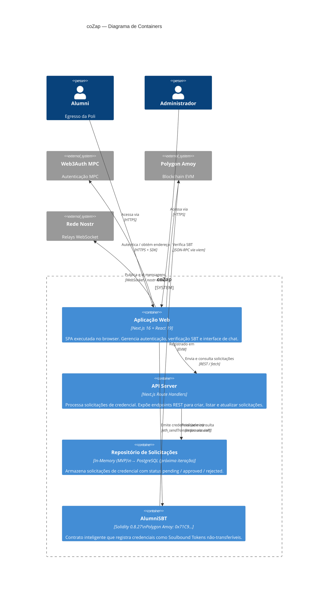

# C4 Model — Nível 2: Containers

Detalha os containers que compõem o coZap e como se comunicam entre si e com sistemas externos.

```mermaid
C4Container
  title coZap — Diagrama de Containers

  Person(alumni, "Alumni", "Egresso da Poli")
  Person(admin, "Administrador")

  System_Ext(web3auth, "Web3Auth MPC", "Autenticação MPC")
  System_Ext(polygon, "Polygon Amoy", "Blockchain EVM")
  System_Ext(nostr, "Rede Nostr", "Relays WebSocket")

  System_Boundary(cozap, "coZap") {

    Container(browser, "Aplicação Web", "Next.js 16 + React 19", "SPA executada no browser. Gerencia autenticação, verificação SBT e interface de chat.")

    Container(apiServer, "API Server", "Next.js Route Handlers", "Processa solicitações de credencial. Expõe endpoints REST para criar, listar e atualizar solicitações.")

    Container(store, "Repositório de Solicitações", "In-Memory (MVP)\n→ PostgreSQL (próxima iteração)", "Armazena solicitações de credencial com status pending / approved / rejected.")

    Container(contract, "AlumniSBT", "Solidity 0.8.27\nPolygon Amoy: 0x71C9...", "Contrato inteligente que registra credenciais como Soulbound Tokens não-transferíveis.")
  }

  Rel(alumni, browser, "Acessa via", "HTTPS")
  Rel(admin, browser, "Acessa via", "HTTPS")

  Rel(browser, web3auth, "Autentica / obtém endereço", "HTTPS + SDK")
  Rel(browser, polygon, "Verifica SBT", "JSON-RPC via viem")
  Rel(browser, nostr, "Publica e lê mensagens", "WebSocket / nostr-tools")
  Rel(browser, apiServer, "Envia e consulta solicitações", "REST / fetch")

  Rel(apiServer, store, "Persiste e consulta", "In-process call")

  Rel(browser, contract, "Emite credencial (admin)", "eth_sendTransaction via viem")
  Rel(contract, polygon, "Registrado em", "EVM")
```
