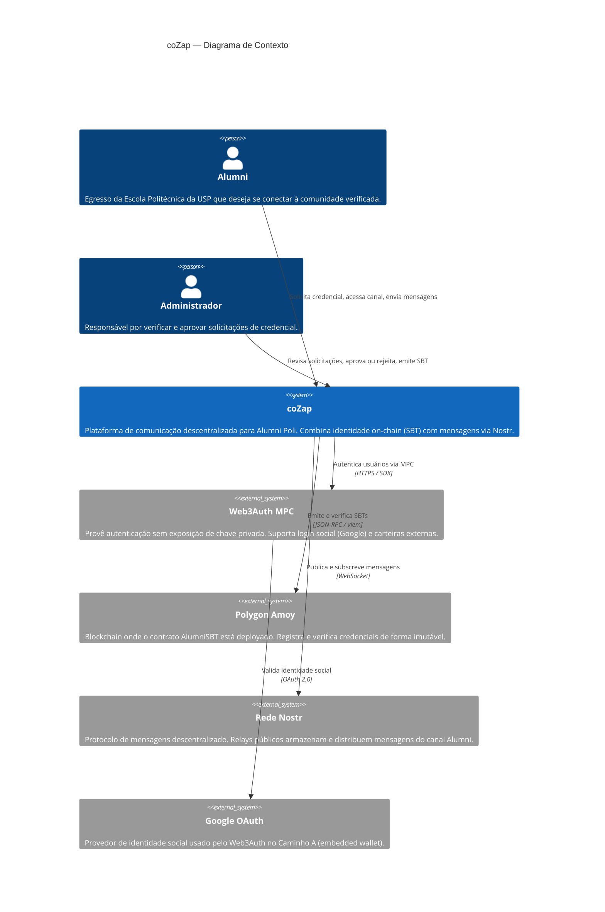

# C4 Model — Nível 1: Contexto

Mostra os atores que interagem com o coZap e os sistemas externos com os quais ele se comunica.

```mermaid
C4Context
  title coZap — Diagrama de Contexto

  Person(alumni, "Alumni", "Egresso da Escola Politécnica da USP que deseja se conectar à comunidade verificada.")
  Person(admin, "Administrador", "Responsável por verificar e aprovar solicitações de credencial.")

  System(cozap, "coZap", "Plataforma de comunicação descentralizada para Alumni Poli. Combina identidade on-chain (SBT) com mensagens via Nostr.")

  System_Ext(web3auth, "Web3Auth MPC", "Provê autenticação sem exposição de chave privada. Suporta login social (Google) e carteiras externas.")
  System_Ext(polygon, "Polygon Amoy", "Blockchain onde o contrato AlumniSBT está deployado. Registra e verifica credenciais de forma imutável.")
  System_Ext(nostr, "Rede Nostr", "Protocolo de mensagens descentralizado. Relays públicos armazenam e distribuem mensagens do canal Alumni.")
  System_Ext(google, "Google OAuth", "Provedor de identidade social usado pelo Web3Auth no Caminho A (embedded wallet).")

  Rel(alumni, cozap, "Solicita credencial, acessa canal, envia mensagens")
  Rel(admin, cozap, "Revisa solicitações, aprova ou rejeita, emite SBT")

  Rel(cozap, web3auth, "Autentica usuários via MPC", "HTTPS / SDK")
  Rel(cozap, polygon, "Emite e verifica SBTs", "JSON-RPC / viem")
  Rel(cozap, nostr, "Publica e subscreve mensagens", "WebSocket")
  Rel(web3auth, google, "Valida identidade social", "OAuth 2.0")
```
