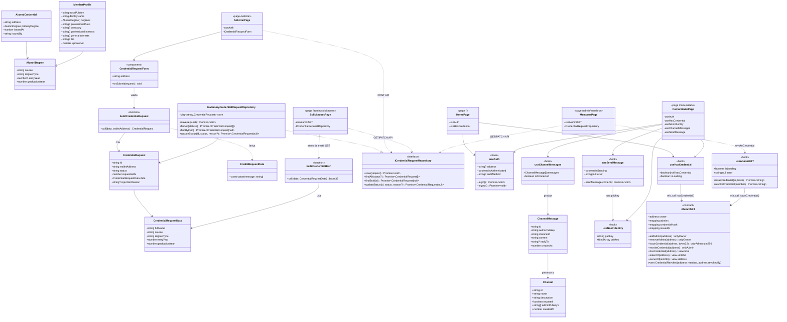

# Diagrama de Classes — coZap

Representa as entidades, interfaces, hooks, componentes e contrato do sistema no estado atual.

```mermaid
classDiagram

  %% ───────────────────────────────
  %% CORE — Tipos de domínio
  %% ───────────────────────────────

  class CredentialRequestData {
    +string fullName
    +string course
    +string degreeType
    +number entryYear
    +number graduationYear
  }

  class CredentialRequest {
    +string id
    +string walletAddress
    +string status
    +number requestedAt
    +CredentialRequestData data
    +string? rejectionReason
  }

  class AlumniDegree {
    +string course
    +string degreeType
    +number? entryYear
    +number graduationYear
  }

  class AlumniCredential {
    +string address
    +AlumniDegree primaryDegree
    +number issuedAt
    +string issuedBy
  }

  class MemberProfile {
    +string nostrPubkey
    +string displayName
    +AlumniDegree[] degrees
    +string? professionalArea
    +string? company
    +string[] professionalInterests
    +string[] generalInterests
    +string? bio
    +number updatedAt
  }

  class ChannelMessage {
    +string id
    +string authorPubkey
    +string channelId
    +string content
    +string? replyTo
    +number createdAt
  }

  class Channel {
    +string id
    +string name
    +string description
    +boolean required
    +string[] adminPubkeys
    +number createdAt
  }

  class InvalidRequestData {
    +constructor(message: string)
  }

  CredentialRequest --> CredentialRequestData
  AlumniCredential --> AlumniDegree
  MemberProfile --> AlumniDegree
  ChannelMessage --> Channel : pertence a

  %% ───────────────────────────────
  %% CORE — Funções puras
  %% ───────────────────────────────

  class buildCredentialRequest {
    <<function>>
    +call(data, walletAddress) CredentialRequest
  }

  class buildCredentialHash {
    <<function>>
    +call(data: CredentialRequestData) bytes32
  }

  buildCredentialRequest --> CredentialRequest : cria
  buildCredentialRequest ..> InvalidRequestData : lança
  buildCredentialHash --> CredentialRequestData : usa

  %% ───────────────────────────────
  %% WEB — Repositório
  %% ───────────────────────────────

  class ICredentialRequestRepository {
    <<interface>>
    +save(request) Promise~void~
    +findAll(status?) Promise~CredentialRequest[]~
    +findById(id) Promise~CredentialRequest|null~
    +updateStatus(id, status, reason?) Promise~CredentialRequest|null~
  }

  class InMemoryCredentialRequestRepository {
    -Map~string,CredentialRequest~ store
    +save(request) Promise~void~
    +findAll(status?) Promise~CredentialRequest[]~
    +findById(id) Promise~CredentialRequest|null~
    +updateStatus(id, status, reason?) Promise~CredentialRequest|null~
  }

  InMemoryCredentialRequestRepository ..|> ICredentialRequestRepository
  InMemoryCredentialRequestRepository --> CredentialRequest

  %% ───────────────────────────────
  %% WEB — Hooks
  %% ───────────────────────────────

  class useAuth {
    <<hook>>
    +string? address
    +boolean isAuthenticated
    +string? authMethod
    +login() Promise~void~
    +logout() Promise~void~
  }

  class useHasCredential {
    <<hook>>
    +boolean|null hasCredential
    +boolean isLoading
  }

  class useAlumniSBT {
    <<hook>>
    +issueCredential(to, hash) Promise~string~
    +revokeCredential(member) Promise~string~
    +boolean isLoading
    +string|null error
  }

  class useNostrIdentity {
    <<hook>>
    +string pubkey
    +Uint8Array privkey
  }

  class useChannelMessages {
    <<hook>>
    +ChannelMessage[] messages
    +boolean isConnected
  }

  class useSendMessage {
    <<hook>>
    +sendMessage(content) Promise~void~
    +boolean isSending
    +string|null error
  }

  useHasCredential --> AlumniSBT : eth_call hasCredential()
  useAlumniSBT --> AlumniSBT : eth_call issueCredential()
  useChannelMessages --> ChannelMessage : produz
  useSendMessage ..> useNostrIdentity : usa privkey

  %% ───────────────────────────────
  %% WEB — Componentes e Páginas
  %% ───────────────────────────────

  class CredentialRequestForm {
    <<component>>
    +string address
    +onSubmit(request) void
  }

  class HomePage {
    <<page />>
    -useAuth
    -useHasCredential
  }

  class SolicitarPage {
    <<page /solicitar>>
    -useAuth
    -CredentialRequestForm
  }

  class ComunidadePage {
    <<page /comunidade>>
    -useAuth
    -useHasCredential
    -useNostrIdentity
    -useChannelMessages
    -useSendMessage
  }

  class SolicitacoesPage {
    <<page /admin/solicitacoes>>
    -useAlumniSBT
    -ICredentialRequestRepository
  }

  class MembrosPage {
    <<page /admin/membros>>
    -useAlumniSBT
    -ICredentialRequestRepository
  }

  CredentialRequestForm ..> buildCredentialRequest : valida
  SolicitarPage --> CredentialRequestForm
  SolicitarPage ..> ICredentialRequestRepository : POST API
  SolicitacoesPage ..> ICredentialRequestRepository : GET/PATCH API
  SolicitacoesPage ..> buildCredentialHash : antes de emitir SBT
  MembrosPage ..> ICredentialRequestRepository : GET/PATCH API
  MembrosPage ..> useAlumniSBT : revokeCredential
  HomePage --> useAuth
  HomePage --> useHasCredential
  ComunidadePage --> useAuth
  ComunidadePage --> useHasCredential
  ComunidadePage --> useNostrIdentity
  ComunidadePage --> useChannelMessages
  ComunidadePage --> useSendMessage

  %% ───────────────────────────────
  %% CONTRATO — AlumniSBT (Solidity)
  %% ───────────────────────────────

  class AlumniSBT {
    <<contract>>
    +address owner
    +mapping admins
    +mapping credentialHash
    +mapping issuedAt
    +addAdmin(address) onlyOwner
    +removeAdmin(address) onlyOwner
    +issueCredential(address, bytes32) onlyAdmin uint256
    +revokeCredential(address) onlyAdmin
    +hasCredential(address) view bool
    +tokenOf(address) view uint256
    +ownerOf(uint256) view address
    event CredentialRevoked(address member, address revokedBy)
  }

  %% ───────────────────────────────
  %% LEGENDA DE REVISÃO (remover após aceite)
  %% 🟡 amarelo = classe modificada nesta US
  %% 🟢 verde   = classe nova nesta US
  %% 🔴 vermelho = classe/elemento removido (nenhum nesta US)
  %% ───────────────────────────────
  classDef modified fill:#ffe066,stroke:#b8860b,color:#000
  classDef added    fill:#90ee90,stroke:#2e7d32,color:#000
  classDef removed  fill:#ff6b6b,stroke:#b71c1c,color:#000

```
