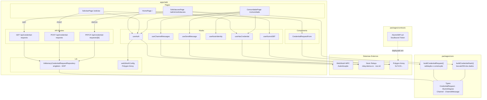

# Diagrama de Componentes — coZap

Representa os pacotes, componentes e suas dependências. As setas indicam direção de dependência.

```mermaid
graph TD
  subgraph EXT["Sistemas Externos"]
    W3A["Web3Auth MPC\nAutenticação"]
    NOSTR["Nostr Relays\nrelay.damus.io · nos.lol"]
    CHAIN["Polygon Amoy\n0x71C9..."]
  end

  subgraph CORE["packages/core"]
    TYPES["Types\nCredentialRequest · AlumniDegree\nChannel · ChannelMessage"]
    BUILD_REQ["buildCredentialRequest()\nvalidação e construção"]
    BUILD_HASH["buildCredentialHash()\nkeccak256 dos dados"]
  end

  subgraph CONTRACTS["packages/contracts"]
    SBT["AlumniSBT.sol\nSoulbound Token"]
  end

  subgraph WEB["apps/web"]

    subgraph LIB["Lib"]
      REPO["InMemoryCredentialRequestRepository\nsingleton · MVP"]
      CFG["web3AuthConfig\nPolygon Amoy"]
    end

    subgraph API["API Routes"]
      API_GET["GET /api/credential-requests"]
      API_POST["POST /api/credential-requests"]
      API_PATCH["PATCH /api/credential-requests/[id]"]
    end

    subgraph HOOKS["Hooks"]
      H_AUTH["useAuth"]
      H_HAS["useHasCredential"]
      H_SBT["useAlumniSBT"]
      H_NOSTR_ID["useNostrIdentity"]
      H_MSGS["useChannelMessages"]
      H_SEND["useSendMessage"]
    end

    subgraph COMPONENTS["Components"]
      FORM["CredentialRequestForm"]
    end

    subgraph PAGES["Pages"]
      P_HOME["HomePage  /"]
      P_SOLIC["SolicitarPage  /solicitar"]
      P_COM["ComunidadePage  /comunidade"]
      P_ADMIN["SolicitacoesPage  /admin/solicitacoes"]
    end

  end

  %% Pages → Hooks
  P_HOME --> H_AUTH
  P_HOME --> H_HAS
  P_SOLIC --> H_AUTH
  P_SOLIC --> FORM
  P_COM --> H_AUTH
  P_COM --> H_HAS
  P_COM --> H_NOSTR_ID
  P_COM --> H_MSGS
  P_COM --> H_SEND
  P_ADMIN --> H_SBT

  %% Pages → API
  P_SOLIC -->|POST| API_POST
  P_ADMIN -->|GET| API_GET
  P_ADMIN -->|PATCH| API_PATCH

  %% API → Repository
  API_GET --> REPO
  API_POST --> REPO
  API_PATCH --> REPO

  %% Components → Core
  FORM --> BUILD_REQ
  P_ADMIN --> BUILD_HASH

  %% Hooks → Config / External
  H_AUTH --> CFG
  H_AUTH --> W3A
  H_HAS --> CHAIN
  H_SBT --> CHAIN
  H_MSGS --> NOSTR
  H_SEND --> NOSTR

  %% Contract → Blockchain
  SBT -.->|deployado em| CHAIN

  %% Core types
  REPO --- TYPES
  BUILD_REQ --- TYPES
  BUILD_HASH --- TYPES
```
