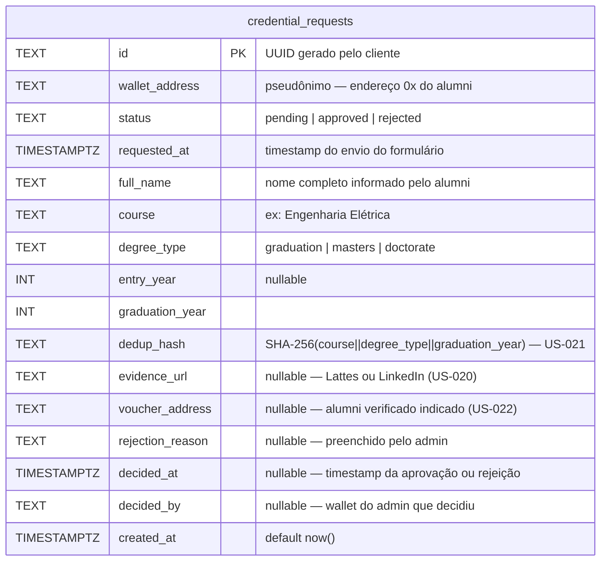

# Modelo de Dados — coZap

> Atualizar este arquivo sempre que o schema Prisma for alterado.

## Contexto

coZap combina dados on-chain (SBT no contrato `AlumniSBT`) com dados off-chain (solicitações de
credencial, perfis de membros). Este documento cobre apenas a camada off-chain (PostgreSQL via Prisma).

### Ciclo de vida da credencial

```
Alumni preenche formulário
        │
        ▼
  CredentialRequest (status = pending)
        │
        ├─── Admin aprova ──► SBT emitido on-chain  ◄── fonte de verdade da credencial
        │                     CredentialRequest (status = approved) — audit trail permanente
        │
        └─── Admin rejeita ──► CredentialRequest (status = rejected) — audit trail + dedup (US-021)
```

A credencial aprovada **é** o SBT on-chain. O registro off-chain é exclusivamente audit trail e
suporte ao fluxo de administração. Nunca é deletado.

---

## Schema atual

### `credential_requests`

Uma solicitação corresponde a **uma formação primária** — a base para emissão do SBT.
Alumni com mais de uma formação na Poli registram as demais via `MemberProfile` (US-007/008).



---

## Classificação de sensibilidade

| Campo | Classificação | Proteção |
|---|---|---|
| `full_name` | Dado pessoal — visível na comunidade por design | Acesso via API autenticada; DB com acesso restrito |
| `wallet_address` | Pseudônimo público na blockchain | Acesso via API autenticada |
| `evidence_url` | Pode conter nome/foto do perfil | Não expor publicamente; acesso restrito a admins |
| `voucher_address` | Pseudônimo público | — |
| `course`, `degree_type`, `graduation_year` | Quasi-identificador | Baixo risco isolado |
| `rejection_reason` | Dado administrativo | Acesso restrito a admins |
| `dedup_hash` | Hash unidirecional | Não sensível |

> **Transparência intencional:** a comunidade Alumni Poli é fechada e verificada. O nome completo
> dos membros é compartilhado intencionalmente — alumni devem saber com quem estão se comunicando.
> A proteção é contra vazamentos externos (controle de acesso ao banco, API autenticada), não
> contra visibilidade interna.

---

## Decisões em aberto

| # | Questão | Prioridade |
|---|---|---|
| D-001 | **Política de retenção de dados** — por quanto tempo manter dados pessoais de solicitações encerradas? Avaliar LGPD art. 16. | Baixa |
| D-002 | **Membros inativos** — definir o que é inatividade (último login? ausência de mensagens?). Fluxo: tentar recuperar o membro → avisar que SBT será suspenso → alumni pode solicitar reativação futuramente. | Baixíssima |
