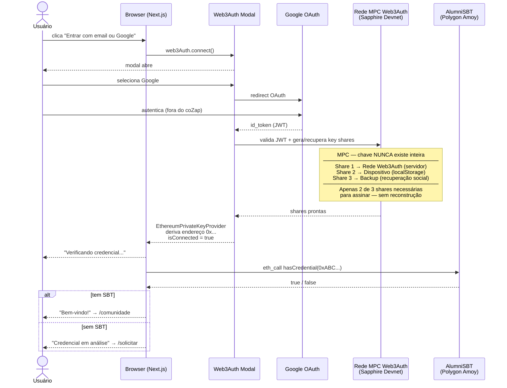
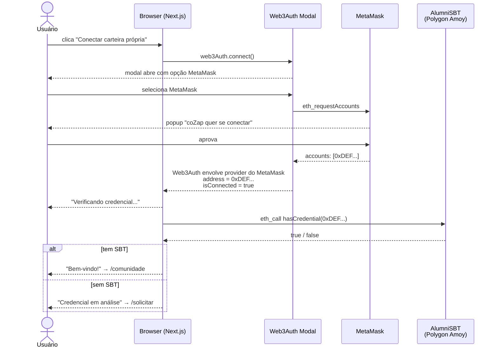
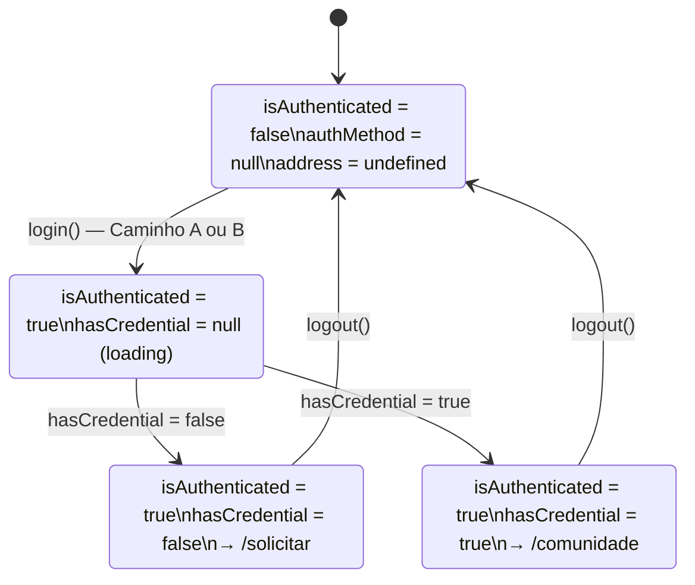

# Fluxo de Login — coZap

## Caminho A — Email / Google (Embedded Wallet)

```mermaid
sequenceDiagram
    actor U as Usuário
    participant B as Browser (Next.js)
    participant M as Web3Auth Modal
    participant G as Google OAuth
    participant MPC as Rede MPC Web3Auth<br/>(Sapphire Devnet)
    participant C as AlumniSBT<br/>(Polygon Amoy)

    U->>B: clica "Entrar com email ou Google"
    B->>M: web3Auth.connect()
    M-->>U: modal abre

    U->>M: seleciona Google
    M->>G: redirect OAuth
    U->>G: autentica (fora do coZap)
    G-->>M: id_token (JWT)

    M->>MPC: valida JWT + gera/recupera key shares

    note over MPC: MPC — chave NUNCA existe inteira<br/>──────────────────────────────<br/>Share 1 → Rede Web3Auth (servidor)<br/>Share 2 → Dispositivo (localStorage)<br/>Share 3 → Backup (recuperação social)<br/>──────────────────────────────<br/>Apenas 2 de 3 shares necessárias<br/>para assinar — sem reconstrução

    MPC-->>M: shares prontas
    M-->>B: EthereumPrivateKeyProvider<br/>deriva endereço 0x...<br/>isConnected = true

    B-->>U: "Verificando credencial..."

    B->>C: eth_call hasCredential(0xABC...)
    C-->>B: true / false

    alt tem SBT
        B-->>U: "Bem-vindo!" → /comunidade
    else sem SBT
        B-->>U: "Credencial em análise" → /solicitar
    end
```

---

## Caminho B — Carteira Própria (MetaMask)

```mermaid
sequenceDiagram
    actor U as Usuário
    participant B as Browser (Next.js)
    participant M as Web3Auth Modal
    participant MM as MetaMask
    participant C as AlumniSBT<br/>(Polygon Amoy)

    U->>B: clica "Conectar carteira própria"
    B->>M: web3Auth.connect()
    M-->>U: modal abre com opção MetaMask

    U->>M: seleciona MetaMask
    M->>MM: eth_requestAccounts
    MM-->>U: popup "coZap quer se conectar"
    U->>MM: aprova
    MM-->>M: accounts: [0xDEF...]

    M-->>B: Web3Auth envolve provider do MetaMask<br/>address = 0xDEF...<br/>isConnected = true

    B-->>U: "Verificando credencial..."

    B->>C: eth_call hasCredential(0xDEF...)
    C-->>B: true / false

    alt tem SBT
        B-->>U: "Bem-vindo!" → /comunidade
    else sem SBT
        B-->>U: "Credencial em análise" → /solicitar
    end
```

---

## Estado resultante em `useAuth`

```mermaid
stateDiagram-v2
    [*] --> NaoLogado

    NaoLogado --> VerificandoSBT: login() — Caminho A ou B
    VerificandoSBT --> SemSBT: hasCredential = false
    VerificandoSBT --> ComSBT: hasCredential = true

    NaoLogado: isAuthenticated = false\nauthMethod = null\naddress = undefined

    VerificandoSBT: isAuthenticated = true\nhasCredential = null (loading)

    SemSBT: isAuthenticated = true\nhasCredential = false\n→ /solicitar

    ComSBT: isAuthenticated = true\nhasCredential = true\n→ /comunidade

    SemSBT --> NaoLogado: logout()
    ComSBT --> NaoLogado: logout()
```
